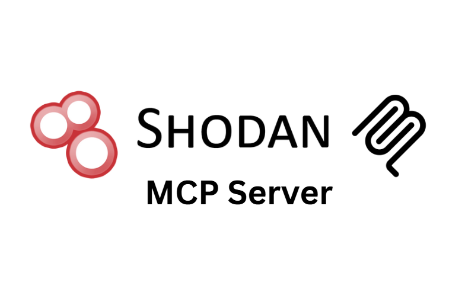

# Shodan MCP Server

A Model Context Protocol (MCP) server that provides access to Shodan API functionality and CVE database, allowing AI assistants to query information about internet-connected devices, services, and vulnerabilities.

## Features

### Network Intelligence

- **Host Information**: Get detailed information about specific IP addresses
- **Search Capabilities**: Search Shodan's database for devices and services
- **Network Scanning**: Scan network ranges (CIDR notation) for devices
- **SSL Certificate Information**: Get SSL certificate details for domains
- **IoT Device Search**: Find specific types of IoT devices

### Vulnerability Intelligence

- **CVE Lookup**: Get detailed information about specific vulnerabilities
- **Vulnerability Search**: Search CVEs with advanced filters (product, KEV status, EPSS scores)
- **CPE Information**: Get Common Platform Enumeration data for products
- **Latest Vulnerabilities**: Access newest CVEs and Known Exploited Vulnerabilities
- **Exploit Prediction**: Get CVEs sorted by EPSS exploit prediction scores

## Installation

1. Clone the repository:

   ```bash
   git clone https://github.com/Cyreslab-AI/shodan-mcp-server.git
   cd shodan-mcp-server
   ```

2. Install dependencies:

   ```bash
   npm install
   ```

3. Build the server:

   ```bash
   npm run build
   ```

4. Set up your Shodan API key:

   ```bash
   export SHODAN_API_KEY="your-api-key-here"
   ```

5. Start the server:
   ```bash
   npm start
   ```

## MCP Integration

This server can be integrated with Claude or other MCP-compatible AI assistants. To add it to Claude Desktop or Claude.app:

1. Add the server to your MCP settings:

   ```json
   {
     "mcpServers": {
       "shodan": {
         "command": "node",
         "args": ["/path/to/shodan-mcp-server/build/index.js"],
         "env": {
           "SHODAN_API_KEY": "your-api-key-here"
         }
       }
     }
   }
   ```

2. Restart Claude to load the new MCP server.

## Available Tools

### Search & Host Information Tools

#### get_host_info

Get detailed information about a specific IP address.

**Parameters:**

- `ip` (required): IP address to look up
- `max_items` (optional): Maximum number of items to include in arrays (default: 5)
- `fields` (optional): List of fields to include in the results (e.g., ['ip_str', 'ports', 'location.country_name'])

#### search_shodan

Search Shodan's database for devices and services.

**Parameters:**

- `query` (required): Shodan search query (e.g., 'apache country:US')
- `page` (optional): Page number for results pagination (default: 1)
- `facets` (optional): List of facets to include in the search results (e.g., ['country', 'org'])
- `max_items` (optional): Maximum number of items to include in arrays (default: 5)
- `fields` (optional): List of fields to include in the results (e.g., ['ip_str', 'ports', 'location.country_name'])
- `summarize` (optional): Whether to return a summary of the results instead of the full data (default: false)

#### get_host_count

Get the count of hosts matching a search query without consuming query credits.

**Parameters:**

- `query` (required): Shodan search query to count hosts for
- `facets` (optional): List of facets to include in the count results (e.g., ['country', 'org'])

#### scan_network_range

Scan a network range (CIDR notation) for devices.

**Parameters:**

- `cidr` (required): Network range in CIDR notation (e.g., 192.168.1.0/24)
- `max_items` (optional): Maximum number of items to include in results (default: 5)
- `fields` (optional): List of fields to include in the results (e.g., ['ip_str', 'ports', 'location.country_name'])

#### search_iot_devices

Search for specific types of IoT devices.

**Parameters:**

- `device_type` (required): Type of IoT device to search for (e.g., 'webcam', 'router', 'smart tv')
- `country` (optional): Optional country code to limit search (e.g., 'US', 'DE')
- `max_items` (optional): Maximum number of items to include in results (default: 5)

### SSL & Certificate Tools

#### get_ssl_info

Get SSL certificate information for a domain.

**Parameters:**

- `domain` (required): Domain name to look up SSL certificates for (e.g., example.com)

### DNS Tools

#### dns_lookup

Resolve hostnames to IP addresses using DNS lookup.

**Parameters:**

- `hostnames` (required): List of hostnames to resolve (e.g., ['google.com', 'facebook.com'])

#### reverse_dns_lookup

Get hostnames for IP addresses using reverse DNS lookup.

**Parameters:**

- `ips` (required): List of IP addresses to lookup (e.g., ['8.8.8.8', '1.1.1.1'])

#### get_domain_info

Get comprehensive domain information including subdomains and DNS records.

**Parameters:**

- `domain` (required): Domain name to lookup (e.g., 'google.com')
- `history` (optional): Include historical DNS data (default: false)
- `type` (optional): DNS record type filter (A, AAAA, CNAME, NS, SOA, MX, TXT)
- `page` (optional): Page number for pagination (default: 1)

### Search Utility Tools

#### list_search_facets

List all available search facets that can be used with Shodan queries.

**Parameters:** None

#### list_search_filters

List all available search filters that can be used in Shodan queries.

**Parameters:** None

#### parse_search_tokens

Parse a search query to understand which filters and parameters are being used.

**Parameters:**

- `query` (required): Shodan search query to parse and analyze

### Infrastructure Tools

#### list_ports

List all ports that Shodan crawls on the Internet.

**Parameters:** None

#### list_protocols

List all protocols that can be used when performing on-demand Internet scans.

**Parameters:** None

### CVE & Vulnerability Tools

#### get_cve_info

Get detailed information about a specific CVE.

**Parameters:**

- `cve_id` (required): CVE ID to look up (e.g., 'CVE-2021-44228')

#### search_cves

Search for vulnerabilities with various filters.

**Parameters:**

- `cpe23` (optional): CPE 2.3 string to search for (e.g., 'cpe:2.3:a:apache:log4j:\*')
- `product` (optional): Product name to search for vulnerabilities (e.g., 'apache', 'windows')
- `is_kev` (optional): Filter for Known Exploited Vulnerabilities only
- `sort_by_epss` (optional): Sort results by EPSS score (Exploit Prediction Scoring System)
- `start_date` (optional): Start date for filtering CVEs (YYYY-MM-DD format)
- `end_date` (optional): End date for filtering CVEs (YYYY-MM-DD format)
- `limit` (optional): Maximum number of results to return (default: 10)
- `skip` (optional): Number of results to skip for pagination (default: 0)

#### get_cpes

Get Common Platform Enumeration (CPE) information for products.

**Parameters:**

- `product` (optional): Product name to search for (e.g., 'apache', 'windows')
- `vendor` (optional): Vendor name to filter by (e.g., 'microsoft', 'apache')
- `version` (optional): Version to filter by (e.g., '2.4.1')
- `limit` (optional): Maximum number of results to return (default: 10)
- `skip` (optional): Number of results to skip for pagination (default: 0)

#### get_newest_cves

Get the newest vulnerabilities from the CVE database.

**Parameters:**

- `limit` (optional): Maximum number of results to return (default: 10)

#### get_kev_cves

Get Known Exploited Vulnerabilities (KEV) from CISA.

**Parameters:**

- `limit` (optional): Maximum number of results to return (default: 10)

#### get_cves_by_epss

Get CVEs sorted by EPSS score (Exploit Prediction Scoring System).

**Parameters:**

- `limit` (optional): Maximum number of results to return (default: 10)

### Account & Utility Tools

#### get_api_info

Get information about your API plan including credits and limits.

**Parameters:** None

#### get_account_profile

Get account profile information including membership status and credits.

**Parameters:** None

#### get_my_ip

Get your current IP address as seen from the Internet.

**Parameters:** None

## Available Resources

- `shodan://host/{ip}`: Information about a specific IP address

## API Limitations

Some Shodan API endpoints require a paid membership. The following features are only available with a paid Shodan API key:

- Search functionality (search_shodan, scan_network_range, get_ssl_info, search_iot_devices, get_host_count, get_domain_info)
- Network scanning
- SSL certificate lookup
- IoT device search

**Note**: CVE database functionality (get_cve_info, search_cves, get_cpes, get_newest_cves, get_kev_cves, get_cves_by_epss) is completely free and does not require a paid Shodan subscription.

## License

MIT

## Developed by

[Cyreslab.ai](https://cyreslab.ai)

## Citation
If you use this project in your research or publications, please cite it as follows:

```bibtex @misc{shodanmcp2025, 
author = {Bassem Abidi and Moudather Chelbi},
title = {Shodan MCP Server},
year = {2025},
howpublished = {https://github.com/Cyreslab-AI/shodan-mcp-server},
note = {Accessed: 2025-06-29}} ```
